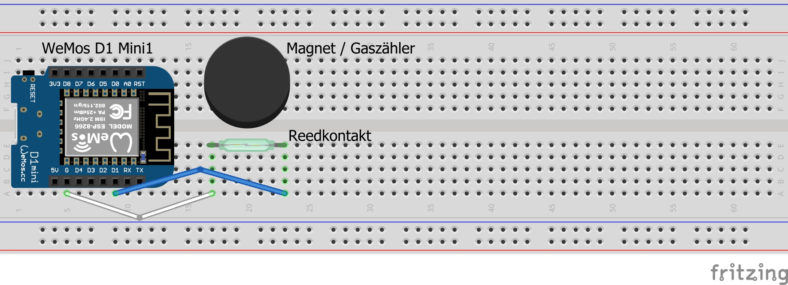

# Impulszähler mit MQTT / HTTP Schnittstelle

Dies ist ein ganz simpler Sketch für einen Impulszähler basierend auf einem Wemos D1 Mini Mikrocontroller.

Der Impulszähler besitzt 6 digitale Zählereingänge und kann diese gleichzeitig unabhängig voneiander verarbeiten. Das heißt, es können bis zu 6 Zähler, die Impulssignale ausgeben, gleichzeitig angeschlossen werden.

Ursprünglich konzipiert ist diese Lösung zum Auslesen eines Gaszählers, dessen Zählwerk einen integrierten Dauermagneten besitzt. Auf diese Weise liefert dieser Zähler pro 0.01 m³ Gas einen magnetischen Impuls. Dieser Impuls lässt sich über einen Reedkontakt, der bei Anliegen eines magnetischen Feldes einen Stromkreis schließt, abgreifen und über einen digitalen Eingang des Mikrocontrollers abgreifen.

Darüber hinaus können aber auch weitere Zähler (Wasseruhren, Durchflusssensoren, Drehstromzähler mit Impuls-LED, Ferraris-Zähler) angeschlossen werden, lediglich der Reedkontakt müsste hier gegen jeweils geeignete andere Peripherie ausgetauscht werden, um zum Beispiel optische in elektrische Impulse umzuwandeln.

## Features
- Besitzt 6 unabhängige Zählereingänge (PINs D1 - D6)
-- Alle 6 Eingänge werden in voneinander unabhängigen Routinen über Interrupts gezählt
-- Entprellzeit pro Eingang frei konfigurierbar (in Millisekunden)
- MQTT-Schnittstelle
-- Versendet die gezählten Impulse regelmäßig (alle 30 Sekunden) an einen MQTT-Broker
-- Entprellzeit pro Eingang kann per MQTT konfiguriert werden, indem zum Beispiel eine Nachricht auf den Topic /SmartHome/Sensor/Haustechnikraum/Impulszaehler/Zaehler_1/Entprellzeit mit dem Inhalt 1000 gesendet wird
- HTTP-Schnittstelle
-- Über einen bereitgestellten Webserver können die gezählten Impulse per http abgefragt werden (http://<ipAdresseDesWMOS>)

## Benötigte Teile

- Wemos D1 Mini (ESP8266)
- USB-Netzteil
- Reedkontakt (für Gaszähler)
- Dauermagnet (zum Testen)
- Kabel

## Schaltplan

 

## Umsetzung

- In der src/PulseCounter.ino sind die folgenden Konstanten auf die tatsächlichen Werte anzupassen:

	// Zugangsdaten zum WLAN:
	const char* ssid = "meineWLAN-SSID";
	const char* password = "meinWLANPasswort";

	// Zugangsdaten zum MQTT-Broker:
	const char* mqtt_server = "HostnameMQTT-Broker";
	const char* mqtt_user = "meinMQTTUserName";
	const char* mqtt_password = "meinMQTTPasswort";
	
- Falls gewünscht können die Namen der MQTT-Topics noch angepasst werden, diese sind per Default

	// Topic, auf das vom WMOS die gezählten Impulse geschrieben werden
	"/SmartHome/Sensor/Haustechnikraum/Impulszaehler/Zaehler_" + String(i) + "/Impulse"
	
	// Topic, über das die Entprellzeit der einzelnen Zählereingänge konfiguriert werden können
	"/SmartHome/Sensor/Haustechnikraum/Impulszaehler/Zaehler_" + String(i) + "/Entprellzeit";

- Folgende Library muss dem Projekt hinzugefügt werden: 
--  https://github.com/knolleary/pubsubclient

- Anschließend den Sketch auf den Mikrocontroller flashen