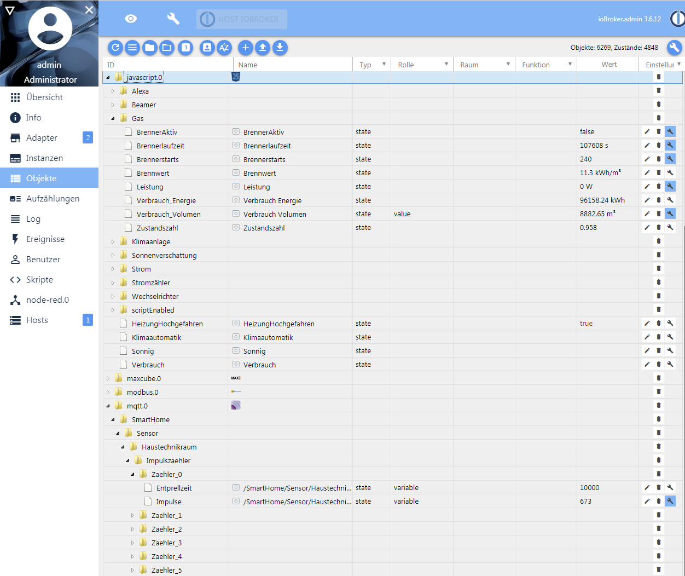

# Impulszähler mit MQTT / HTTP Schnittstelle und Einbindung in ioBroker

Dies ist ein ganz simpler Sketch für einen Impulszähler basierend auf einem Wemos D1 Mini Mikrocontroller.

Der Impulszähler besitzt 6 digitale Zählereingänge und kann diese gleichzeitig unabhängig voneiander verarbeiten. Das heißt, es können bis zu 6 Zähler, die Impulssignale ausgeben, gleichzeitig angeschlossen werden.

Ursprünglich konzipiert ist diese Lösung zum Auslesen eines Gaszählers, dessen Zählwerk einen integrierten Dauermagneten besitzt. Auf diese Weise liefert dieser Zähler pro 0.01 m³ Gas einen magnetischen Impuls. Dieser Impuls lässt sich über einen Reedkontakt, der bei Anliegen eines magnetischen Feldes einen Stromkreis schließt, abgreifen und über einen digitalen Eingang des Mikrocontrollers abgreifen.

Darüber hinaus können aber auch weitere Zähler (Wasseruhren, Durchflusssensoren, Drehstromzähler mit Impuls-LED, Ferraris-Zähler) angeschlossen werden, lediglich der Reedkontakt müsste hier gegen jeweils geeignete andere Peripherie ausgetauscht werden, um zum Beispiel optische in elektrische Impulse umzuwandeln.

Der Impulszähler kann dank der Kommunikation per MQTT in eine Vielzahl von Integrationsplattformen für SmartHome-Geräte eingebunden werden. Ich habe den Impulszähler in ioBroker eingebunden und stelle hier eine Anleitung und mein Blockly-Skript zur Auswertung des Impulszählers zur Verfügung.

## Videos

Zu dem Impulszähler und der Einbindung in ioBroker gibt es auch eine Serie an Videos:

Teil 1: https://www.youtube.com/watch?v=59IVzMe4mbc

Inhalte: 
- Projektidee / Vorstellung des Projekts
- Schaltung auf dem Breadboard
- Kurze Demonstration 
  - manuelle Auslösung mit einem Magneten, Log-Ausgabe im Serial Monitor
  - Übertragung der Werte per MQTT den ioBroker
  - Konfiguration der Entprellzeit in ioBroker
  
Teil 2: https://www.youtube.com/watch?v=mi9-MsSPrNs

Inhalte:
- Schaltplan und Verweis auf die Github-Projektseite
- 3D Druck eines Gehäuses für den Wemos D1 Mini
- Installation des Reedkontaktes an dem Gaszähler
- Integration in ioBroker
  - Einbindung per MQTT
  - Datenpunkte, die aus den Impulsen berechnet werden
  - Vorstellung des Blocky-Scripts zur Berechnung der Datenpunkte
  - Darstellung und Analyse der Datenpunkte in einem Flot-Diagramm

## Features
- Besitzt 6 unabhängige Zählereingänge (PINs D1 - D6)
  - Alle 6 Eingänge werden in voneinander unabhängigen Routinen über Interrupts gezählt
  - Entprellzeit pro Eingang frei konfigurierbar (in Millisekunden)
- MQTT-Schnittstelle
  - Versendet die gezählten Impulse regelmäßig (alle 30 Sekunden) an einen MQTT-Broker
  - Entprellzeit pro Eingang kann per MQTT konfiguriert werden, indem zum Beispiel eine Nachricht auf den Topic /SmartHome/Sensor/Haustechnikraum/Impulszaehler/Zaehler_1/Entprellzeit mit dem Inhalt 1000 gesendet wird
- HTTP-Schnittstelle
  - Über einen bereitgestellten Webserver können die gezählten Impulse per http abgefragt werden (http://<ipAdresseDesWMOS>)


## Benötigte Teile

- Wemos D1 Mini (ESP8266)
- USB-Netzteil
- Reedkontakt (für Gaszähler)
- Dauermagnet (zum Testen)
- Kabel

## Schaltplan

<br/>


## Umsetzung (Wemos)

- In der src/PulseCounter.ino sind die folgenden Konstanten auf die tatsächlichen Werte anzupassen:

```
// Zugangsdaten zum WLAN:
const char* ssid = "meineWLAN-SSID";
const char* password = "meinWLANPasswort";
   
// Zugangsdaten zum MQTT-Broker:
const char* mqtt_server = "HostnameMQTT-Broker";
const char* mqtt_user = "meinMQTTUserName";
const char* mqtt_password = "meinMQTTPasswort";
```
	
- Falls gewünscht können die Namen der MQTT-Topics noch angepasst werden, diese sind per Default

```
// Topic, auf das vom WMOS die gezählten Impulse geschrieben werden
"/SmartHome/Sensor/Haustechnikraum/Impulszaehler/Zaehler_" + String(i) + "/Impulse"

// Topic, über das die Entprellzeit der einzelnen Zählereingänge konfiguriert werden können
"/SmartHome/Sensor/Haustechnikraum/Impulszaehler/Zaehler_" + String(i) + "/Entprellzeit";
```

- Folgende Library muss dem Projekt hinzugefügt werden: 
  -  https://github.com/knolleary/pubsubclient

- Anschließend den Sketch auf den Mikrocontroller flashen

## Einbindung in ioBroker

- MQTT-Adapter (Server/Broker) installieren, danach sollte man die oben genannten Topics in den Objekten unter mqtt.0 sehen

- Die folgenden Datenpunkte unter javascript.0.Gas müssen in ioBroker manuell angelegt werden:

<br/>

  - BrennwertAktiv

```
{
  "_id": "javascript.0.Gas.BrennerAktiv",
  "type": "state",
  "common": {
    "name": "BrennerAktiv",
    "role": "",
    "type": "boolean",
    "read": true,
    "write": true,
    "desc": "Manuell erzeugt",
    "def": false,
    "custom": {
      "sql.0": {
        "enabled": true,
        "changesOnly": true,
        "debounce": 0,
        "maxLength": 10,
        "retention": "31536000",
        "changesRelogInterval": 0,
        "changesMinDelta": 0,
        "storageType": "",
        "aliasId": ""
      }
    }
  },
  "native": {},
  "from": "system.adapter.admin.0",
  "user": "system.user.admin",
  "ts": 1574253457129,
  "acl": {
    "object": 1636,
    "state": 1636,
    "owner": "system.user.admin",
    "ownerGroup": "system.group.administrator"
  }
}
```

  - Brennerlaufzeit

```  
{
  "_id": "javascript.0.Gas.Brennerlaufzeit",
  "type": "state",
  "common": {
    "name": "Brennerlaufzeit",
    "role": "",
    "type": "number",
    "read": true,
    "write": true,
    "desc": "Manuell erzeugt",
    "min": 0,
    "def": 0,
    "unit": "s",
    "custom": {
      "sql.0": {
        "enabled": true,
        "changesOnly": true,
        "debounce": "1000",
        "retention": "31536000",
        "changesRelogInterval": 0,
        "changesMinDelta": 0,
        "storageType": "",
        "aliasId": ""
      }
    }
  },
  "native": {},
  "from": "system.adapter.admin.0",
  "user": "system.user.admin",
  "ts": 1574254464730,
  "acl": {
    "object": 1636,
    "state": 1636,
    "owner": "system.user.admin",
    "ownerGroup": "system.group.administrator"
  }
}
```

  - Brennerstarts

```
{
  "from": "system.adapter.admin.0",
  "user": "system.user.admin",
  "ts": 1574253385038,
  "common": {
    "name": "Brennerstarts",
    "role": "",
    "type": "number",
    "desc": "Manuell erzeugt",
    "min": 0,
    "def": 0,
    "read": true,
    "write": true,
    "custom": {
      "sql.0": {
        "enabled": true,
        "changesOnly": true,
        "debounce": "1000",
        "retention": "31536000",
        "changesRelogInterval": 0,
        "changesMinDelta": 0,
        "storageType": "",
        "aliasId": ""
      }
    }
  },
  "native": {},
  "acl": {
    "object": 1636,
    "owner": "system.user.admin",
    "ownerGroup": "system.group.administrator",
    "state": 1636
  },
  "_id": "javascript.0.Gas.Brennerstarts",
  "type": "state"
}
```

  - Brennwert

```
{
  "_id": "javascript.0.Gas.Brennwert",
  "type": "state",
  "common": {
    "name": "Brennwert",
    "role": "",
    "type": "number",
    "read": true,
    "write": true,
    "desc": "Manuell erzeugt",
    "min": 0,
    "max": 100,
    "def": 0,
    "unit": "kWh/m³"
  },
  "native": {},
  "from": "system.adapter.admin.0",
  "user": "system.user.admin",
  "ts": 1574027126898,
  "acl": {
    "object": 1636,
    "state": 1636,
    "owner": "system.user.admin",
    "ownerGroup": "system.group.administrator"
  }
}
```

  - Leistung

```
{
  "_id": "javascript.0.Gas.Leistung",
  "type": "state",
  "common": {
    "name": "Leistung",
    "role": "",
    "type": "number",
    "read": true,
    "write": true,
    "desc": "Manuell erzeugt",
    "unit": "W",
    "custom": {
      "sql.0": {
        "enabled": true,
        "changesOnly": true,
        "debounce": "1000",
        "retention": "31536000",
        "changesRelogInterval": 0,
        "changesMinDelta": 0,
        "storageType": "",
        "aliasId": ""
      }
    }
  },
  "native": {},
  "from": "system.adapter.admin.0",
  "user": "system.user.admin",
  "ts": 1574028675624,
  "acl": {
    "object": 1636,
    "state": 1636,
    "owner": "system.user.admin",
    "ownerGroup": "system.group.administrator"
  }
}
```

  - Verbrauch_Energie

```
{
  "from": "system.adapter.admin.0",
  "user": "system.user.admin",
  "ts": 1574028125473,
  "common": {
    "name": "Verbrauch Energie",
    "role": "",
    "type": "number",
    "desc": "Manuell erzeugt",
    "unit": "kWh",
    "min": 0,
    "max": 999999,
    "def": 0,
    "read": true,
    "write": true
  },
  "native": {},
  "acl": {
    "object": 1638,
    "owner": "system.user.admin",
    "ownerGroup": "system.group.administrator",
    "state": 1638
  },
  "_id": "javascript.0.Gas.Verbrauch_Energie",
  "type": "state"
}
```

  - Verbrauch_Volumen

```
{
  "common": {
    "name": "Verbrauch Volumen",
    "desc": "Verbrauchszählerwert Volumen Gas",
    "type": "number",
    "unit": "m³",
    "role": "value",
    "custom": {
      "sql.0": {
        "enabled": true,
        "changesOnly": true,
        "debounce": "1000",
        "retention": "31536000",
        "changesRelogInterval": 0,
        "changesMinDelta": 0,
        "storageType": "",
        "aliasId": ""
      }
    }
  },
  "native": {
    "name": "Verbrauch Volumen",
    "desc": "Verbrauchszählerwert Volumen Gas",
    "type": "number",
    "unit": "m³",
    "role": "value"
  },
  "type": "state",
  "from": "system.adapter.javascript.0",
  "user": "system.user.admin",
  "ts": 1571492829109,
  "_id": "javascript.0.Gas.Verbrauch_Volumen",
  "acl": {
    "object": 1636,
    "owner": "system.user.admin",
    "ownerGroup": "system.group.administrator",
    "state": 1636
  }
}
```

  - Zustandszahl 

```
{
  "_id": "javascript.0.Gas.Zustandszahl",
  "type": "state",
  "common": {
    "name": "Zustandszahl",
    "role": "",
    "type": "number",
    "read": true,
    "write": true,
    "desc": "Manuell erzeugt",
    "def": false
  },
  "native": {},
  "from": "system.adapter.admin.0",
  "user": "system.user.admin",
  "ts": 1574026993941,
  "acl": {
    "object": 1636,
    "state": 1636,
    "owner": "system.user.admin",
    "ownerGroup": "system.group.administrator"
  }
}
```

- Anschließend den Blockly-Export unter src/iobroker/ImpulszaehlerAuswertungBlocklyExport.xml in ein neues Blockly importieren oder alternativ ImpulsZaehlerAuswertung.js als neues Javascript anlegen und das Skript aktiv schalten